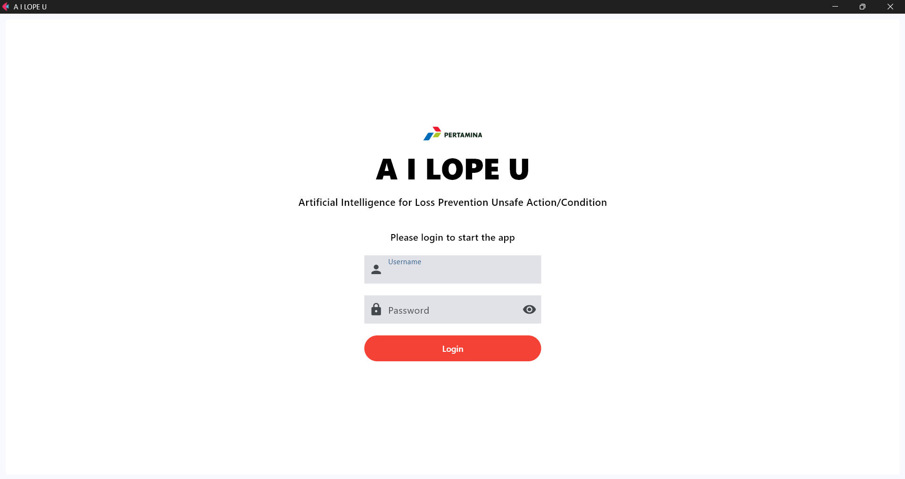
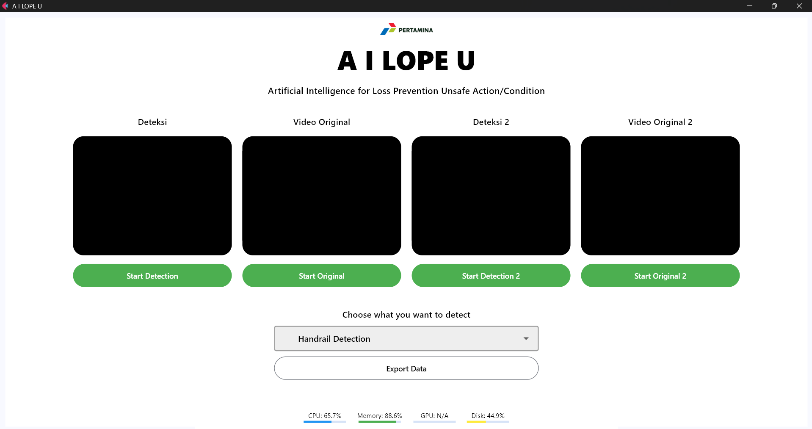
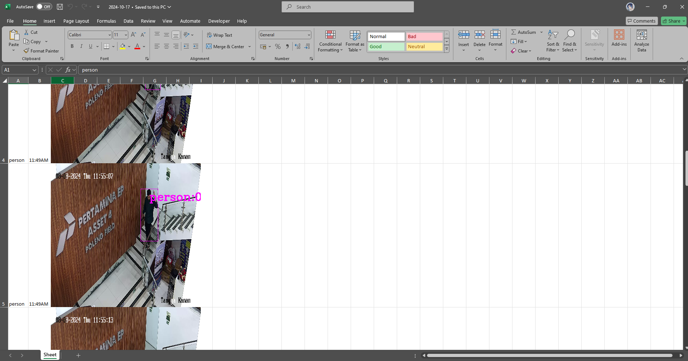

---
# AI LOPE U

An AI-powered detection system designed to enhance workplace safety by identifying unsafe conditions in real-time. Developed for **Pertamina EP, Poleng Field**, this system monitors key safety behaviors, logs violations, and sends notifications to help prevent accidents.
---

## User Interface Screenshots

### Login Page



### Main Dashboard



### Violation Log



---

## Table of Contents

1. [Features](#features)
2. [Technologies Used](#technologies-used)
3. [System Architecture](#system-architecture)
<!-- 4. [Installation](#installation)
5. [Usage](#usage)
6. [Configuration](#configuration)
7. [Exporting Data](#exporting-data)
8. [License](#license) -->

---

## Features

- **Handrail Usage Detection**: Detects whether workers are holding onto handrails.
- **Safety Equipment Detection**: Verifies that essential safety gear is being worn.
- **Line of Fire Detection**: Identifies and alerts users to hazardous zones.
- **Violation Logging**: Automatically records violations, which can be exported to an Excel file.
- **Notification System**: Integrated with an ESP32-based system to trigger an alert light and buzzer for real-time notifications.

---

## Technologies Used

- **Programming Language**: Python
- **Machine Learning**: YOLO (You Only Look Once) version 8 by [Ultralytics](https://docs.ultralytics.com/models/yolov8/) for object detection
- **Image Processing**: OpenCV
- **UI Framework**: [Flet](https://flet.dev/) (for the user interface)
- **Microcontroller**: ESP32 (for alert light and buzzer control)
- **Data Export**: Excel (via `openpyxl` library for CSV/Excel file generation)

---

## System Architecture

1. **Image Processing & Detection**: Using YOLO, the system detects specific safety conditions (e.g., handrail hold, presence of PPE, line of fire).
2. **Alert System**: If a violation is detected, the system triggers the ESP32 microcontroller to activate a visual and auditory alert.
3. **Logging & Export**: All violations are recorded and can be exported to an Excel file for further analysis.

---

<!-- ## Installation

1. **Clone the Repository**

   ```bash
   git clone github link
   cd folder
   ```

2. **Install Required Packages**
   Ensure Python 3.7+ is installed, then install dependencies:

   ```bash
   pip install ultralytics openpyxl flet requests pyserial playsound
   ```

3. **Set Up ESP32**
   - Load the provided firmware onto your ESP32 device.
   - Make sure the ESP32 device is connected to your buzzer light and PC/Laptop.
4. **Initialize App**
   - Create a file named `video_path.py` on the app directory.
   - Write your CCTV/Video input url into this file. Check the example below:
     ```bash
     video_path_handrail = "rtsp://username:password@ip_address:554/Streaming/Channels/301"
     video_path_line_of_fire = "rtsp://username:password@ip_address:554/Streaming/Channels/501"
     video_path_safety_equipment = "rtsp://username:password@ip_address:554/Streaming/Channels/401"
     ```

---

## Usage

1. **Run the Application**
   Launch the main detection application:

   ```bash
   python app.py
   ```

2. **Interface with the System**
   - Login on the app by using `admin` as username and `admin` as password. You can change the username and password by finding this line of code:
     ```bash
     if username.value == 'admin' and password.value == 'admin':
     ```
     Change the username.value and password.value to whatever you want.
   - Choose what you want to detect from the dropdown.
   - Press the `Start` button to start the detection.
   - Use the Flet-based UI to monitor violations and access real-time detection.
   - Violations will trigger alerts via the ESP32, and they’ll be logged in the application.
   - To export the data, press the `Export Data` button on the app. The data will be exported into `exported_data` folder with `yyyy-mm-dd` name format.
3. **Additional Notes**
   - You can check whether your ESP32 is already connected by clicking on the Feedback Test button.
   - App can only be started once. Once you clicked stop, you need to reopen the app to start again.

---

## Configuration

To customize detection parameters, alert settings, or UI options:

1. Insert any of your custom models into the `models` folder and rename it.
2. Feel free to modify parameters such as confidence thresholds, delays, and logging preferences.
3. Save changes and restart the application for updates to take effect.

---

## Exporting Data

To export logged violations:

1. In the UI, navigate to the **Export Data** section.
2. Click **Export to Excel** to generate an `.xlsx` file containing all logged violations.
3. The file will be saved in the `exported_data` directory by default.

---

## License

This project is licensed under the MIT License - see the [LICENSE](LICENSE) file for details.

---

**Note**: Please refer to the code comments and additional documentation in the `docs` folder for more in-depth information on modules, classes, and methods. -->
